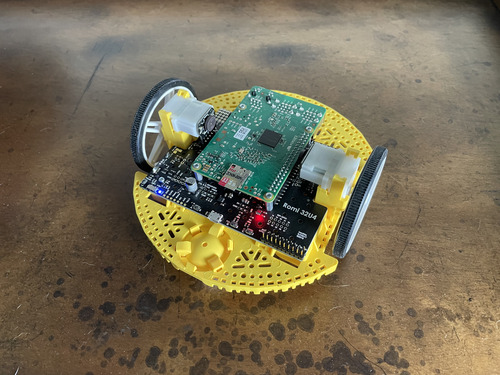

# MarsRobot

This a Robot Demo for running F Prime on a Pi-compatible Linux platform.
The goal is to illustrate how to set up an F Prime project in a tangible way for people getting started using the framework.

[F´ (F Prime)](https://fprime.jpl.nasa.gov) is a component-driven framework that enables rapid development and deployment of spaceflight and other embedded software applications.

## Pololu Romi

The Romi was selected as the plaftorm for this project, largely because the parts are available and easily purchased.
Specific consideration was given to minimizing the amount design work and striving for relatively low assembly difficulty, in order to focus on the software learning.

- [Pololu Romi Chassis Kit](https://www.pololu.com/product/3504) - Ours were white and yellow, but any color will do
- [Pololu Romi Encoder Pair Kit](https://www.pololu.com/product/3542) - Requires soldering but a no-solder motor/encoder pair is available
- [Pololu Romi 32U4 Control Board](https://www.pololu.com/product/3544) - Provides and interesting and programmable Atmega34u4 to communicate with
- Raspberry Pi with WiFi access - Wifi setup is beyond the scope of this repo, we used a 3B+ and 4B
- 6 AA Batteries - Your local grocery or home improvement store

The code running on the Romi's Atmega32u4 is located in the ``arduino_code`` folder.
For our purposes, we treat is as a black box sub-system that we can control from a Raspberry Pi over I2C.
Uploading the firmare to the Romi is a straightforward Arduino upload process, even though it requires some libraries from Pololu for the Romi32u4 platform.
